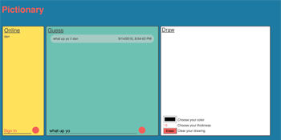

# Pictionary

## Overview
* A drawing game with chat feature built using AngularJS, Node.js and Socket.io. Can be played by multiple people on different devices.




### Technologies, frameworks, & programming Languages used
* HTML5 & CSS3
* Canvas
* JavaScript
* jQuery
* Node.js
* Socket.io


### NPMs to install

```node
$ npm install socket.io --save
```


### Url to live demo

[Demo](http://www.danielbarranco.com/chat-room/)